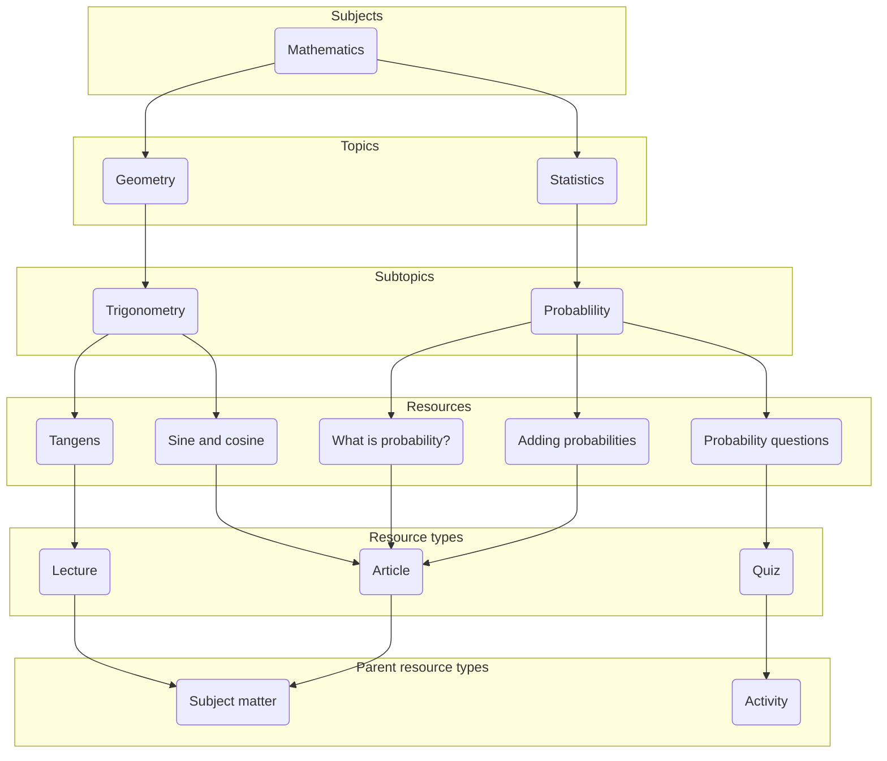
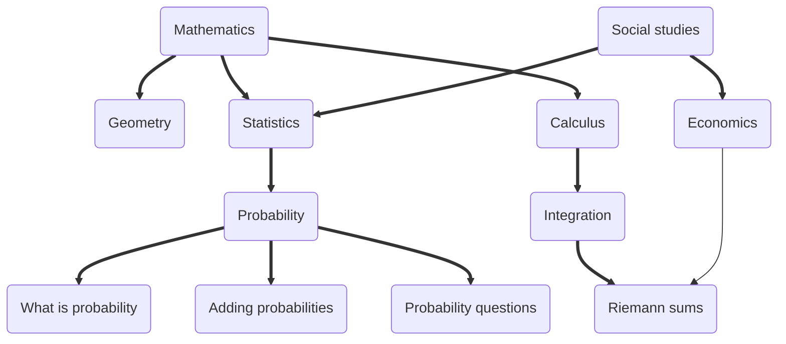
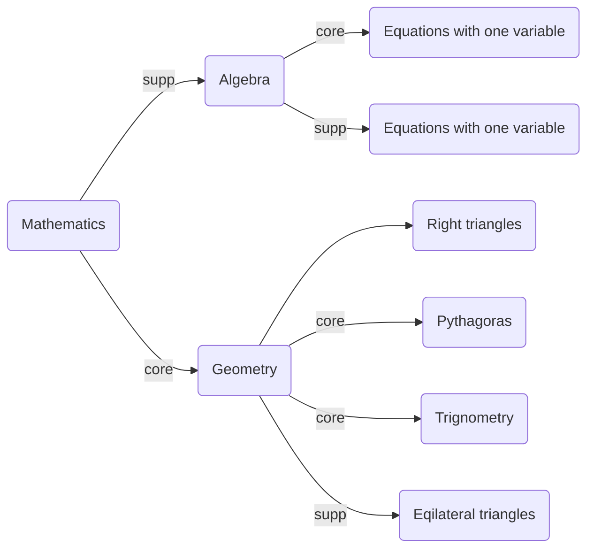

# taxonomy-api

Rest service and relational database for organizing content.

Are you a developer? Go [here](projectBuild.md) for project build documentation.

## What does this service do?

This API is for organising and categorising the content provided by NDLA. At the heart of the structure are the *resources*, which
represent the actual content, such as articles and learning paths (which are compositions of other resources). 
The organisation of content allows for a context rich user interface to be built on top
of this API where the content is displayed in context of a *subject* and its *topics*, with hyperlinks to related content. 

Please note that this API is all about metadata. The actual content is stored in other APIs, identified by the content URI
stored with each node, subject, topic and resource in this API. 

The resources are categorised according to subjects and topics. A subject is a high-level field of study, such as Mathematics
or Science, loosely based on the subject curricula at [udir.no](https://www.udir.no/lk20/eng04-02?lang=eng), whereas a topic 
is a hierarchical sub-division of the subject into subject areas.

This organisation gives us a tree representation of the content, where the subjects are at the roots of the tree, the 
topics make up the branches, and the resources are the leaves. Note, however, that this is not a strict tree-structure, 
since resources may belong to several parents (see "Multiple parent connections" below). *Subjects*, *topics* and 
*resources* are stored as the same datatype *node* in the database, which gives us the possibility to expand the 
hirerarchy with new types later. 

The taxonomy data model consists of *entities* and *connections* between entities. 

The central entities in the taxonomy are Node (Subject, Topic, Resource, Programme, Node) and Resource-type. The taxonomy 
stores metadata for each entity, such as name and content URI. Translations of names can also be stored. 

In addition to the entities, the taxonomy stores the connections you make between entities. Each connection also has 
metadata attached to it, such as which entities are connected, and whether this connection is the primary connection 
(see "Multiple parent connections" below). Nodes can be connected to other nodes, nodes to resource types, and resource 
types to parent resources types. The connections can also be labelled with rank. This makes it easy to tell which order 
all the nodes are meant to be presented.  

Below you can see a figure of how entities can be connected. We will go through how this structure can be realised 
through the API. For details on the use of each service, please see the Swagger documentation. 

### Nodes (Subjects, topics and resources)

First, create a subject with the name Mathematics with a POST call to `/v1/nodes` and nodetype SUBJECT. When this call 
returns you'll get a location. This location contains the path to this node within the nodes resource, e.g., 
`/v1/nodes/urn:subject:342`, where `urn:subject:342` is the ID of the newly created node. Any time you need to change 
or retrieve this subject you'll be using this ID. The nodetype specifies the resulting id of the node. 

Next, create two Topic entities for Geometry and Statistics (POST to `/v1/nodes` with nodetype TOPIC). If you have topic 
descriptions that you want to use as the content for these entities, you can include their content URI. The content URIs 
can also be added later (PUT to `/v1/nodes/{id}`).

The subject and topic can now be connected with a POST call to `/v1/node-connections`.
Use the IDs for the two entities you want to connect. Nodes usually only have one parent, but resources often have multiple.

A topic can have subtopics. In our example Trigonometry is a subtopic of Geometry. To connect the two, create a topic named Trigonometry.
Then add a connection between the Geometry topic and the Trigonometry topic with a POST call to `/v1/node-connections`.

The figure above also contains a topic for Statistics and the subtopic Probability. These can be connected in the same
manner as previously described. The subject Mathematics will then have two topics, while each topic will have a subtopic.
Call GET on `/v1/nodes/{id}/nodes` to list out the children connected to the node. From this example you will get two topics: 
Geometry and Statistics.

A GET call to `/v1/nodes` will yield all the nodes. This endpoint supports some parameters allowing you to get what you need. 
Nodetype SUBJECT gives you all the subjects. To limit the amount of data returned, resources are omitted unless you specify
`nodeType=RESOURCE`. This may change later.

A resource (or learning resource) represents (for now) an article or a learning path. Its Content URI is
an ID referring to the actual content which is stored in a different API, e.g., the Article API or the LearningPath API.

Resources are created with a POST call to `/v1/nodes` and nodetype RESOURCE. You can connect your resources
to nodes by making a POST call to `/v1/node-connections`. (Legacy `/v1/topic-resources`) You can update a resource
(for instance, change its Content URI) by making a PUT call to `/v1/nodes/{id}`.

List all resources connected to a node with a GET call to `/v1/nodes/{id}/resources`. The endpoint supports the parameter `recursive`
which allows you to fetch resources for the specified node, and all its children. (Legacy endpoint `/v1/subjects/{id}/resources`
specifies `recursive=true` by default). For the Mathematics node, this would return nothing unless you specify `recursive=true`.
With recursive this call would return a list with these five entities: Tangens, Sine and Cosine, What is probability?, Adding probabilities, and
Probability questions.

If you retrieve all resources connected to the node Statistics, you'll get an empty list, because it doesn't have any
resources connected directly to it. If you ask for all resources recursively, you'll get the three resources from the
Probability topic, since it is a subtopic of Statistics.

  
Legacy info

### Subjects and topics (legacy endpoints)

First, create a subject with the name Mathematics with a POST call to `/v1/subjects`. When this call returns you'll get a location.
This location contains the path to this subject within the subjects resource, e.g., `/v1/subjects/urn:subject:342`, where `urn:subject:342`
is the ID of the newly created subject. Any time you need to change or retrieve this subject you'll be using this ID.

Next, create two Topic entities for Geometry and Statistics (POST to `/v1/topics`). If you have topic descriptions that you want to use
as the content for these entities, you can include their content URI. The content URIs can also be added later (PUT to `/v1/subjects` or `/v1/topics`).

The subject and topic can now be connected with a POST call to `/v1/subject-topics`.
Use the IDs for the two entities you want to connect. Topics and resources can have multiple parent connections.
The first connection between a subject and a topic will automatically be marked as the primary connection (see "Multiple parent connections" for details).

A topic can have subtopics. In our example Trigonometry is a subtopic of Geometry. To connect the two, create a topic named Trigonometry.
Then add a connection between the Geometry topic and the Trigonometry topic with a POST call to `/v1/topic-subtopics`.

The figure above also contains a topic for Statistics and the subtopic Probability. These can be connected in the same
manner as previously described. The subject Mathematics will then have two topics, while each topic will have a subtopic.
Call GET on `/v1/subjects/{id}/topics` to list out the topics connected to the subject. From this example you will get two topics: Geometry and Statistics.

A GET call to `/v1/topics` will yield both topics and subtopics. The only thing differentiating a topic
from a subtopic is the connection in `/v1/topic-subtopics`. Similar to the connections between a subject and its topics, you can
get all subtopics for a topic with a GET call to `/v1/topics/{id}/subtopics`.

### Resources (legacy endpoint)

A resource (or learning resource) represents (for now) an article or a learning path. Its Content URI is
an ID referring to the actual content which is stored in a different API, e.g., the Article API or the Learning Path API.

Resources are created in the same way as nodes, but with a POST call to `/v1/resources`. You can connect your resources
to nodes by making a POST call to `/v1/node-resources`. (Legacy `/v1/topic-resources`) You can update a resource
(for instance, change its Content URI) by making a PUT call to `/v1/resources/{id}`.

List all resources connected to a node with a GET call to `/v1/nodes/{id}/resources`. The endpoint supports the parameter `recursive`
which allows you to fetch resources for the specified node, and all its children. (Legacy endpoint `/v1/subjects/{id}/resources`
specifies `recursive=true` by default). For the Mathematics node, this would return nothing unless you specify `recursive=true`.
With recursive this call would return a list with these five entities: Tangens, Sine and Cosine, What is probability, Adding probabilities, and
Probability questions.

If you retrieve all resources connected to the topic Statistics, you'll get an empty list, because it doesn't have any
resources connected directly to it. If you ask for all resources recursively, you'll get the three resources from the
Probability topic, since it is a sub topic of Statistics.

### Updating entities and connections

Updates to existing entities and connections are all handled with PUT calls to the correct service. Please note that all 
PUT calls will *overwrite* the information in the entity. Be sure to include everything you want to keep. The taxonomy 
API does not check for empty fields unless they are required. The easiest way to update an entity is to first retrieve 
the current entity with a GET call to the correct service and then return the object with a PUT call after you make your changes. 
The API cannot check which fields should be unset, which is why all fields must be present (unless it should be unset). 

You should verify that your changes are correct with a GET call after the PUT request (similarly for POST). This is by design, so 
that the client verifies that the changes on the server are correct.

### Resource types

A resource type is a category for tagging and filtering resources. It is a tree structure with two levels. 
In theory, you could make the hierarchy deeper, but that's probably not needed.  

To tag a resource with resource types, first create a resource type with a POST call to `/v1/resource-types`. Then 
connect the Resource to the resource type with a POST call to `/v1/resource-resourcetypes` including both the ID of the 
resource and the resource type. A resource can have multiple resource types, in that case you make several calls POST 
to `/v1/resource-resourcetypes`. 

When you get all resources for a subject or topic you can choose to get only resources matching a particular resource type 
(or a list of resource types). For our example, a GET call to `/v1/nodes/{id}/resources?type={resourceTypeId}` with `resourceTypeId` 
corresponding to the ID of Articles will give you a list of three entities; Sine and Cosine, What is probability, and Adding probability.

### Multiple parent connections
Multiple parent connections for topics are not allowed, but other node-types may. But as some topics such as Statistics may 
be relevant in several subjects, it is possible to have the same contentURI for several topics. This allows us to create 
a structure where Statistics is a topic in Mathematics, but it is also a topic in Social Studies.

In the figure above, primary connections are showed in bold while secondary connections are shown in normal width. Only
resources can have non-primary connections, and have only *one* primary parent. If you set a different connection to 
be primary, another primary connection will become secondary.

The figure above shows how Statistics is a topic in both Mathematics and Social Studies. If you list all the topics in 
Social Studies, Statistics will be in the list. It also shows that Riemann Sums is a resource in both Economics and Integration. 
If you list all the resources in Social Studies or Mathematics, Riemann Sums will be in the list.  

If you delete a primary connection to a resource, a new primary connection will be chosen randomly from the remaining connections. 
If you are changing primary connections, you can choose a new primary connection after you have deleted the old, or before.
If an entity no longer has any connections you will not be able to get a URL for that entity (meaning that this 
entity will not be shown in the production system).

Primary connections are used to determine the default context for a resource or a topic. The context of a resource or a topic is encoded 
in its URL path, which you get by following the primary connections from the resource or topic to the root of the hierarchy.
 
## URLs

Entities have URLs (e.g., `https://ndla.no/subject:1/topic:1/resource:1`) which consists of a scheme (`https`), 
a hostname (`ndla.no`), and a path (`/subject:1/topic:1/resource:1`). The taxonomy API only contains information about the path, since 
the path is directly derived from the taxonomy itself. The hostname and scheme are determined by factors outside the boundary of the
taxonomy API. When you perform a GET call on an entity (using the entity ID), you will also get the primary path to the entity along with 
the name and content URI.

The taxonomy API generates contexts for all entities. The context of an entity is determined by following the connections from 
it to the root of the hierarchy, picking up the IDs of the entities along the way. Entities without connections do not 
have URLs (except nodes specified as root-nodes of the hierarchy).

Using the above figure as an example, we can derive the following paths:

| Name                  | ID               | Path(s)                                                                         | 
|-----------------------|------------------|---------------------------------------------------------------------------------|
| Mathematics           | `urn:subject:1`  | `/subject:1`                                                                    |
| Social studies        | `urn:subject:2`  | `/subject:2`                                                                    |
| Geometry              | `urn:topic:1`    | `/subject:1/topic:1`                                                            |
| Statistics            | `urn:topic:2`    | `/subject:1/topic:2` `/subject:2/topic:2`                                       |
| Calculus              | `urn:topic:3`    | `/subject:1/topic:3`                                                            |
| Economics             | `urn:topic:4`    | `/subject:2/topic:4`                                                            |
| Probability           | `urn:topic:5`    | `/subject:1/topic:2/topic:5` `/subject:2/topic:2/topic:5`                       |
| Integration           | `urn:topic:6`    | `/subject:1/topic:3/topic:6`                                                    |
| What is probability?  | `urn:resource:1` | `/subject:1/topic:2/topic:5/resource:1` `/subject:2/topic:2/topic:5/resource:1` |
| Adding probabilities  | `urn:resource:2` | `/subject:1/topic:2/topic:5/resource:2` `/subject:2/topic:2/topic:5/resource:2` |
| Probability questions | `urn:resource:3` | `/subject:1/topic:2/topic:5/resource:3` `/subject:2/topic:2/topic:5/resource:3` |
| Riemann sums          | `urn:resource:4` | `/subject:1/topic:3/topic:6/resource:4` `/subject:2/topic:4/resource:4`         |

As you can see, several entities have two paths, since they have more than one path to the root of the hierarchy. The primary path is
listed first. 

### The context of URLs

Say that a user is currently browsing the Social Studies subject. Perhaps the user interface shows a heading indicating that 
Social Studies is the selected subject, there may be breadcrumbs indicating the user's current position in the hierarchy, and 
perhaps a treeview showing the hierarchy below the Social Studies subject. User interfaces may vary, but this imaginary system 
would fall within the norm of such systems. 

Now, say that the user wants to navigate to Statistics, which is a first-level topic within Social Studies. Its parent, 
however, is Mathematics. If the link were to transport the user from the subject of Social Studies to Mathematics, they would surely be confused. 
So to preserve the current context, the API finds the possible paths to Statistics, and selects the one most closely resembling the 
user's current position in the hierarchy. In this scenario, the possible paths are `/subject:1/topic:2` and `/subject:2/topic:2`. 
Since the user's current position (the current context) is `/subject:2`, we select `/subject:2/topic:2` as the preferred path, since it
has the first nine characters in common with the current context. The other one, `/subject:1/topic:2` has only one. 

When listing entities, the Taxonomy API always includes a path to each entity in the correct context determined by the request.
In addition all eliglible paths are returned to the requester.
Say that you for instance list all topics under Social Studies. Statistics will be included in the result, and its path will be 
`/subject:2/topic:2`. The API has automatically selected the correct path given the context you provided, and returns only that one. 
If you, on the other hand, ask for all topics under Mathematics, Statistics will be listed with a path of `/subject:1/topic:2`. 
The same principle applies for resources. 

### Topics as root contexts

In the above examples, all paths start with a subject. But sometimes, you encounter a topic which is important enough that it should
be an entry point into the taxonomy in its own right, without being a child of a particular subject. Examples of such topics could
be current events that should have greater visibility for a limited time period, such as the election of parliament. 
Other examples may be strong topics that are always important in several subjects and nearly a subject in itself, such as Statistics. 
 
When you mark a topic as a root context, you allow URLs to start with the id of that topic. In the above example, Statistics 
is a child of both Mathematics and Social Studies, so it is accessible through the paths `/subject:1/topic:2` and `/subject:2/topic:2`. 
If we add Statistics as a root context, it will also be accessible through the path `/topic:2` directly. The same goes for any
sub topics and resources below Statistics:

| Name                  | ID               | Path(s)                                                                                                       | 
|-----------------------|------------------|---------------------------------------------------------------------------------------------------------------|
| Mathematics           | `urn:subject:1`  | `/subject:1`                                                                                                  |
| Social studies        | `urn:subject:2`  | `/subject:2`                                                                                                  |
| Statistics            | `urn:topic:2`    | `/topic:2` `/subject:1/topic:2` `/subject:2/topic:2`                                                          |
| Probability           | `urn:topic:5`    | `/topic:2/topic:5` `/subject:1/topic:2/topic:5` `/subject:2/topic:2/topic:5`                                  |
| What is probability?  | `urn:resource:1` | `/topic:2/topic:5/resource:1` `/subject:1/topic:2/topic:5/resource:1` `/subject:2/topic:2/topic:5/resource:1` |
| Adding probabilities  | `urn:resource:2` | `/topic:2/topic:5/resource:2` `/subject:1/topic:2/topic:5/resource:2` `/subject:2/topic:2/topic:5/resource:2` |
| Probability questions | `urn:resource:3` | `/topic:2/topic:5/resource:3` `/subject:1/topic:2/topic:5/resource:3` `/subject:2/topic:2/topic:5/resource:3` |

 
A topic can be marked as a root context by making a POST call to `/v1/contexts`, and removed by making a DELETE call to the same.
(Additionally you could update the context-variable on the node by making PUT to `/v1/nodes/{id}`)
All subjects are defined as root contexts. Please note that POST and DELETE calls to `/v1/contexts` does not create or remove nodes, 
it only marks those nodes as being a context or not. 

To list all root contexts, make a GET call to `/v1/contexts`. The contexts will be listed with their ID, (translated) name and path. 
 
### Translations

When an entity is created, the textual information entered (such as name) becomes the default translation. Add other 
translations for a subject with a PUT call to `/v1/nodes/{id}/translations/{language}` where language is a valid 
ISO 639-1 language code (equivalent call can be made for all entities). 

When getting one or several entities you can request a specific translation. If the translation exists, the object you 
get back will have the correct translation of name (or any other relevant fields). If you request all resources under a 
subject or topic, all entities that have this translation will use it. The other entities will use the default translation. 
In this way the complete set of resources belonging to a topic or subject will be returned even if the translation the 
user has requested does not exist. All translations are returned in the returned json.
 
You can also get all translations for an entity. Get all available translations with a topic with a GET call to 
`/v1/nodes/{id}/translations`. 

## Relevances

The topics and learning resources contained in a subject may be organised in a way that spans academic years and 
academic programs. Mathematics would, for instance, contain a topic called *geometry*, which contains several learning 
resources. Some of these are considered *core material* in some subjects, but may be offered as *supplementary material* 
in other. 

In the above example, *right triangles*, *pythagoras* and *trignometry* are considered *core material*, while 
*equilateral triangles* are supplementary. Additionally, *algebar* is supplementary material. All resources under 
*algebra* is also supplementary. No connected relevance is considered core. 

Using this data structure it is possible to limit the resources shown in *Mathematics* to find resources that are relevant.

#### Example: List core topics in Mathematics

The results will contain *geometry*, since this is tagged as core material. 

#### Example: List core resources in Mathematics

The results will contain *Equations with one variable*, *Right triangles*, *Pythagoras* and *Trigonometry*, since these 
are tagged as core material.

#### Example: List all resources in Mathematics

The results will contain *Equations with one variable*, *Equations with two variables*, *Right triangles*, *Pythagoras*, 
*Trigonometry* and *Equilateral triangles* since all of these resources are contained in a topic connected to Mathematics. 
                       
### Tagging for multiple subjects

If a resource is used in several subjects, you can tag it as core or supplementary material in each of the subjects
separately. 

## Versioning of a complete api

Since all nodes in the tree/graph are connected, data versioning is handled with multi-tenancy. This is implemented with
schema-based multi-tenancy. The tenancy is connected to a Version-entity in the database, and all requests to `/v1/versions`
is routed to the base schema, taxonomy_api. This makes all version handling consistent. 

When a new version is created, a custom script is triggered and clones another schema, based on the parameters provided.
This script is fetched from [pg-clone-schema](https://github.com/denishpatel/pg-clone-schema/blob/master/clone_schema.sql).
Versions can be based on either the base schema or another version. A version can have one of three stauses: BETA, PUBLISED,
or ARCHIVED. When a BETA schema is published, the current PUBLISHED is set as ARCHIVED. There are no practical limits to
how many versions can be present in the application. Each version get a corresponding hash-value, and the schema name
is based on this value, e.g. taxonomy_api_abcd.

A HttpHeader VersionHash is used to address which schema to communicate with. If no header is provided, the code defaults
to the published version if there is one. If no versions are created, the base schema is used. Values for the header can
be found by fetching list of versions from the versions-endpoint.

Mark that only GET-request uses published version when no header is provided. PUT and POST uses base schema. This is to
support backwards compability for clients. Clients are advised to always use the header value `VersionHash: default` when
interacting with the api, or specify correct version hash from the version-table.

### Publishing changes

When you have a published version and want to make the changes available to clients, you can either make a full or partial 
publish of specified changes. A full publish is the easiest and fastest, and is simply done by making a new version based 
on the base-schema, and then marking the version as published.

A partial publish is more time consuming, but gives more control over what is being published. This is done by using the 
`/v1/nodes/{id}/publish` endpoint. This endpoint takes, in addition to an id of a node in the path, two url-params: sourceId 
and targetId. These params specifies the publicIds of the target and source versions where the node is to be published. If
sourceId is omitted, the base schema is used.

The endpoint goes recursively through the node and _all_ children and copies all data from source to target. This is done 
by registering the publicId of all node-connections and nodes in the changelog-table. A scheduled task in ChangelogService
checks this table every second and starts processing changes whenever any are available. This makes it possible to share
the data-copying between several servers in a cluster. The further down a node-tree a node is published, the shorter the 
time used for copying. 