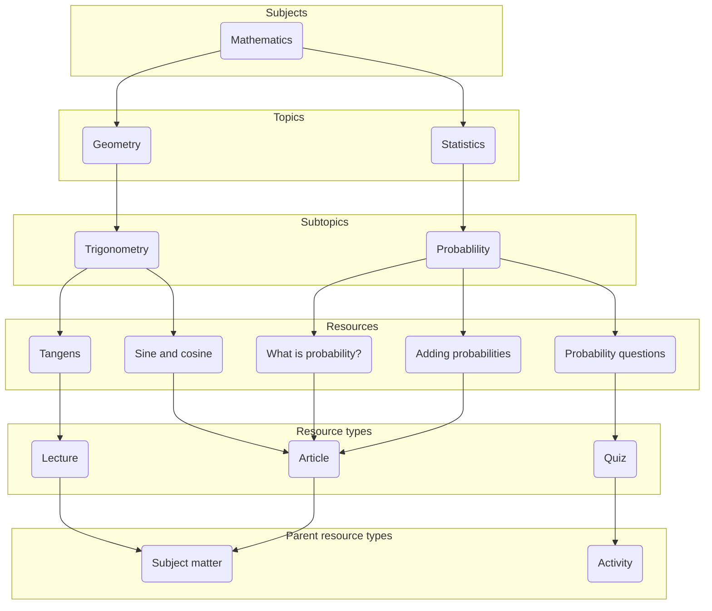

# taxonomy-api

Rest service and relational database for organizing content.

Are you a developer? Go [here](projectBuild.md) for project build documentation.

## What does this service do?

This API is for organising and categorising the content provided by NDLA. At the heart of the structure are the *resources*, which
represent the actual content, such as articles and learning paths. The organisation of content allows for a context-rich user interface to be built on top
of this API, where content is displayed in the context of a *subject* and its *topics*, with hyperlinks to related content.

Please note that this API is all about metadata. The actual content is stored in other APIs, identified by the content URI
stored with each node in this API.

The resources are categorised according to subjects and topics. A subject is a high-level field of study, such as Mathematics
or Science, whereas a topic is a hierarchical sub-division of the subject into subject areas.

This organisation gives us a tree representation of the content, where the subjects are at the roots of the tree, the
topics make up the branches, and the resources are the leaves. Note, however, that this is not a strict tree-structure,
since resources may belong to several parents. *Subjects*, *topics* and
*resources* are all stored as the same datatype, *node*, in the database. This gives us the flexibility to expand the
hierarchy with new types later.

The taxonomy data model consists of *entities* and *connections* between entities.

The central entities in the taxonomy are `Node` (which can be a `Subject`, `Topic`, `Resource`, `Programme`, etc.) and `ResourceType`. The taxonomy
stores metadata for each entity, such as its name and content URI. Translations of names can also be stored.

In addition to the entities, the taxonomy stores the connections between them. Each connection also has
metadata attached to it, such as which entities are connected, and whether this connection is the primary connection.
Nodes can be connected to other nodes, and resources can be connected to resource types. The connections can also be labelled with `rank` and `relevance`.

Below is a diagram illustrating how entities can be connected.

### Nodes (Subjects, topics and resources)

**Note:** We recommend using the `/v1/nodes` and `/v1/node-connections` endpoints for all interactions with the API. Legacy endpoints (`/v1/subjects`, `/v1/topics`, etc.) are deprecated.

You can create a new node with a `POST` call to `/v1/nodes`. The `nodeType` parameter specifies the type of node you are creating (e.g., `SUBJECT`, `TOPIC`, `RESOURCE`).

To connect two nodes, you make a `POST` call to `/v1/node-connections`, providing the public IDs of the parent and child nodes.

You can retrieve a list of all nodes with a `GET` call to `/v1/nodes`. This endpoint supports several filter parameters:
*   `nodeType`: Filters by a comma-separated list of node types. By default, if no other filters are applied, it returns `TOPIC`, `NODE`, `SUBJECT`, and `PROGRAMME`. Resources are only returned if `nodeType=RESOURCE` is specified, or if other filters are used.
*   `language`: An ISO-639-1 language code to get translated content.
*   And many more. See the Swagger documentation for a full list.

To get the children of a specific node, you can use `GET /v1/nodes/{id}/nodes`. The `recursive=true` parameter will fetch all descendants.

### Resource Types

A resource type is a category for tagging and filtering resources. It is a tree structure, so resource types can have parents.

To tag a resource with a resource type, you first create the resource type with a `POST` call to `/v1/resource-types`. Then, you connect the resource to the resource type with a `POST` call to `/v1/resource-resourcetypes`.

### Multiple Parent Connections

While topics can only have one parent, other node types, like resources, can have multiple parents. One of these connections must be marked as the *primary* connection. The primary connection is used to determine the default context and URL for the resource.

If you delete a primary connection, a new primary connection will be chosen randomly from the remaining connections.

### URLs and Contexts

The API generates context-aware URL paths for all entities. The path is derived from the entity's primary connections to the root of the taxonomy.

For example, a resource's path might be `/subject:1/topic:1/resource:1`.

When you request an entity, the API can return a path that is relevant to the current user's context. For example, if a user is browsing the "Social Studies" subject, and a resource is part of both "Social Studies" and "Mathematics", the API will return the path that starts with `/subject:2` (Social Studies).

You can also mark a topic as a "root context" by making a `POST` call to `/v1/contexts`. This allows the topic to be an entry point into the taxonomy, and its URL will not be prefixed by a subject.

### Translations

You can add translations for an entity's text fields (like `name`) with a `PUT` call to `/v1/nodes/{id}/translations/{language}`.

When you request an entity, you can specify a `language` parameter to get the translated content. If a translation doesn't exist for a particular entity, the default language will be returned for that entity.

### Relevances and Rank

Connections between nodes can be assigned a `relevance` (e.g., `core`, `supplementary`) and a `rank`.

*   **Relevance:** This allows you to filter content based on its importance in a particular context. For example, you can request only the "core" resources for a subject.
*   **Rank:** This is used to order nodes within a list, for example, to control the order of topics within a subject.

### Versioning

The API uses a schema-based multi-tenancy system for versioning. Each version of the taxonomy is stored in a separate database schema.

You can create new versions, and publish them. When a new version is published, the previous "published" version is archived.

The `VersionHash` HTTP header is used to specify which version of the taxonomy you want to interact with. If no header is provided, `GET` requests will use the "published" version, while `POST` and `PUT` requests will use the base schema. It is recommended to always provide the `VersionHash` header.

---

## Legacy API Information

  
Click to expand for information on deprecated legacy endpoints.

  The following endpoints are deprecated and will be removed in a future version. Please use the `/v1/nodes` and `/v1/node-connections` endpoints instead.

  *   `/v1/subjects`
  *   `/v1/topics`
  *   `/v1/resources`
  *   `/v1/subject-topics`
  *   `/v1/topic-subtopics`
  *   `/v1/topic-resources`

  These endpoints were used to manage subjects, topics, and resources as separate entities. The new, consolidated API provides a more flexible and consistent way to interact with the taxonomy.

